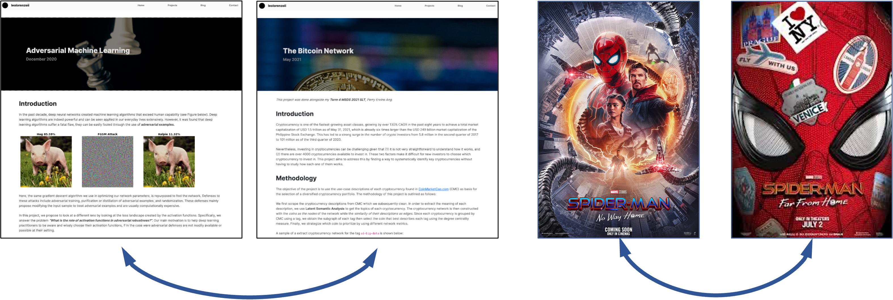

Finding Similar Items
=====================

One of the core problems of data-mining is finding items that are "similar" with each other. Take for example finding Web pages that are near-duplicate of each other. These pages can be duplicate or mirror with each other. Other application of the concept of finding similar items include information retrieval and recommender systems such as movie recommender systems :numref:`finding-similar-items`.

   Applications of finding similar items include finding similar web pages or recommender systems such as a movie recommender system.

In this chapter, we discuss core concepts needed to effectively examine big data and find similar items. We start with discussing the core fundamentals of determining whether two sets are similar, then introduce the concept of shingling. We then introduce Minhashing, a technique to approximate the Jaccard similarity between two or more documents. We then talk about the general theory of **Locality-Sensitive Functions (LSF)** and discuss the LSF for Minhash signatures.

.. toctree::
   :maxdepth: 1

   set-similarity
   shingling
   minhashing
   introduction-to-lsh
   theory-of-lsf
   lsh-for-minhash
   the-lsh-class
   demo-minhash-lsh
